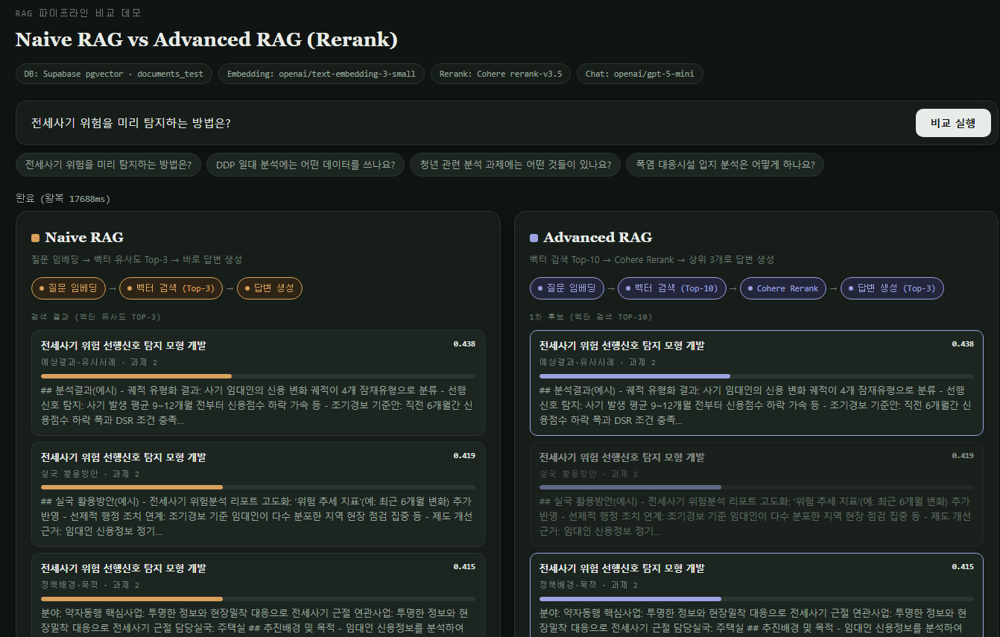
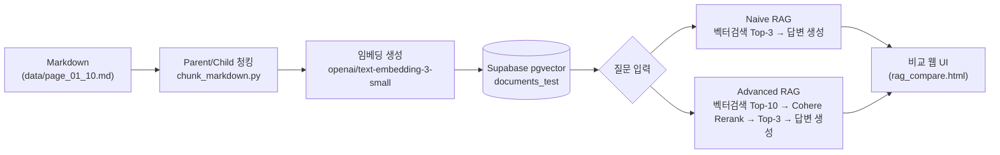

# Seoul RAG Compare

Naive RAG와 Advanced RAG(Cohere Rerank)를 같은 질문에 대해 나란히 실행하고, 검색된 근거·재순위화 결과·최종 답변·지연시간을 한 화면에서 비교하는 데모입니다.


<p align="center">
  
</p>

## 개요

서울시 "2026년 시정 핵심사업 데이터 분석 컨설팅 제안(안)" 문서(공공 데이터, 본 저장소에는 1~10페이지 발췌본만 샘플로 포함)를 소스로 사용합니다.

```
원본 Markdown
  → Parent/Child 청킹 (분석과제 단위 Parent, 소제목 단위 Child)
  → 임베딩 생성 (OpenAI text-embedding-3-small)
  → Supabase pgvector 적재
  → 질문 1개를 Naive RAG / Advanced RAG 두 파이프라인에 동시 실행
  → 비교 웹 UI
```



## Naive RAG vs Advanced RAG

| 단계 | Naive RAG | Advanced RAG |
|---|---|---|
| 임베딩 | `openai/text-embedding-3-small` | `openai/text-embedding-3-small` |
| 1차 검색 | 벡터 유사도 Top-3 | 벡터 유사도 Top-10 |
| 재순위화 | 없음 | Cohere `rerank-v3.5` → Top-3 |
| 답변 생성 | `openai/gpt-5-mini` | `openai/gpt-5-mini` |
| 특징 | 빠르지만 유사도 상위가 항상 정답 근거는 아님 | 후보를 넓게 본 뒤 질의 적합도로 재정렬해 근거 품질을 보정 |

실제로 같은 질문에 대해 두 방식이 채택하는 최종 근거(Top-3)가 달라지는 경우를 화면에서 바로 확인할 수 있습니다.

## 저장소 구조

```
.
├── scripts/
│   ├── chunk_markdown.py       # Markdown → Parent/Child 청크 생성 (+ 검증)
│   ├── load_to_supabase.py     # 청크 → 임베딩 → Supabase 적재
│   ├── rag_lib.py              # Naive/Advanced RAG 공통 파이프라인
│   ├── rag_compare_server.py   # Flask 비교 데모 서버
│   └── web/
│       └── rag_compare.html    # 비교 시각화 프론트엔드
├── data/
│   ├── page_01_10.md           # 원본 문서 1~10페이지(분석과제 1~10) 발췌본
│   └── chunks_page_01_10/      # 청킹 결과 샘플 (parents/children/overview/report)
├── docs/
│   └── screenshot.png
├── requirements.txt
├── .env.example
└── README.md
```

## 시작하기

### 1. 설치

```bash
git clone https://github.com/<your-account>/seoul-rag-compare.git
cd seoul-rag-compare
pip install -r requirements.txt
```

### 2. Supabase 테이블 준비

`documents_test` 테이블과 검색용 RPC 함수가 필요합니다. Supabase 대시보드 → SQL Editor에서 한 번 실행하세요.

```sql
create extension if not exists vector;

create table if not exists documents_test (
  id bigserial primary key,
  content text,
  metadata jsonb,
  embedding vector(1536)
);

create or replace function match_documents_test (
  query_embedding vector(1536),
  match_count int default null,
  filter jsonb default '{}'
) returns table (
  id bigint,
  content text,
  metadata jsonb,
  similarity float
)
language plpgsql
as $$
#variable_conflict use_column
begin
  return query
  select
    id, content, metadata,
    1 - (documents_test.embedding <=> query_embedding) as similarity
  from documents_test
  where metadata @> filter
  order by documents_test.embedding <=> query_embedding
  limit match_count;
end;
$$;
```

### 3. 환경변수 설정

```bash
cp .env.example .env
```

`.env`를 열어 아래 값을 채웁니다.

| 변수 | 용도 | 발급처 |
|---|---|---|
| `SUPABASE_URL`, `SUPABASE_KEY` | pgvector 저장/검색 | Supabase 프로젝트 Settings → API |
| `OPENROUTER_API_KEY` | 임베딩(`text-embedding-3-small`) + 답변 생성(`gpt-5-mini`) | https://openrouter.ai/keys |
| `COHERE_API_KEY` | Advanced RAG 재순위화(`rerank-v3.5`) | https://dashboard.cohere.com/api-keys |

### 4. 청크 임베딩 적재

이미 생성된 샘플 청크(`data/chunks_page_01_10/all_embedding_chunks.jsonl`, 41건: Child 40 + Overview 1)를 그대로 적재합니다.
같은 디렉터리의 `parents.jsonl`(Parent 10건)이 있으면 자동으로 함께 적재되며, Parent는 벡터 검색 대상이 아니므로 임베딩 없이(`embedding = null`) `chunk_type="parent"`로 저장됩니다.

```bash
python scripts/load_to_supabase.py data/chunks_page_01_10/all_embedding_chunks.jsonl \
  --table documents_test \
  --model openai/text-embedding-3-small \
  --api-base https://openrouter.ai/api/v1/embeddings
```

문서를 직접 처음부터 청킹하려면 (표준 라이브러리만으로 동작, `tiktoken` 있으면 정확한 토큰 계산 · 없으면 한국어 문자 기반 fallback):

```bash
python scripts/chunk_markdown.py data/page_01_10.md \
  --output-dir data/chunks_page_01_10 \
  --target-tokens 420 --max-tokens 600 --overlap-tokens 50 \
  --only-tasks 1-10 --expected-tasks 10 \
  --page-range-start 1 --page-range-end 10 --strict
```

### 5. 비교 서버 실행

```bash
python scripts/rag_compare_server.py --port 5000
```

브라우저에서 `http://127.0.0.1:5000` 접속 후 질문을 입력하면 두 파이프라인이 동시에 실행됩니다.

## 청킹 설계

- 문서의 **분석과제**를 Parent 청크 경계로, 4개 소제목(추진배경·주요내용·분석결과·실국 활용방안)을 Child 청크로 분리 — 단순 글자수 분할(RecursiveCharacterTextSplitter류) 대신 문서 구조를 우선 사용
- Child가 600 토큰을 넘을 때만 문단/문장 경계를 우선해 추가 분할, 동일 소제목 내부에서만 50 토큰 overlap 적용
- 모든 Child의 `embedding_text`에 문서명·분야·분석과제명·섹션 등 contextual header를 부여
- HWPX→Markdown 변환 과정에서 생긴 이미지 링크, 표 구분선, 중복 셀, `<br>` 태그 등을 정리하는 전처리 포함
- 실행마다 과제 수·중복·필수 섹션 누락·이미지 잔존 등을 자동 검증해 `chunk_report.json`에 기록 (`--strict` 시 오류가 있으면 종료 코드 1)

### 검색 단계의 Parent 확장 (small-to-big)

벡터 검색은 정밀도가 높은 **Child**에서만 수행하고(Parent는 `chunk_type="parent"`로 표시되어 검색 후보에서 제외), 매칭된 Child의 `parent_id`로 Parent 청크를 조회해 실제 답변 생성 컨텍스트로는 Parent의 전체 본문을 사용합니다 (`rag_lib.fetch_parent_chunks` / `expand_with_parents`). 이렇게 하면 검색은 좁고 정확하게, 생성 근거는 넓고 완전하게 가져갈 수 있습니다.

## 기술 스택

| 영역 | 사용 기술 |
|---|---|
| 벡터 DB | Supabase (PostgreSQL + pgvector) |
| 임베딩 | OpenAI `text-embedding-3-small` (1536차원, OpenRouter 경유) |
| 재순위화 | Cohere `rerank-v3.5` |
| 답변 생성 | OpenAI `gpt-5-mini` (OpenRouter 경유) |
| 백엔드 | Flask |
| 프론트엔드 | Vanilla HTML/CSS/JS (빌드 도구 없음) |

## License

[MIT](LICENSE)
